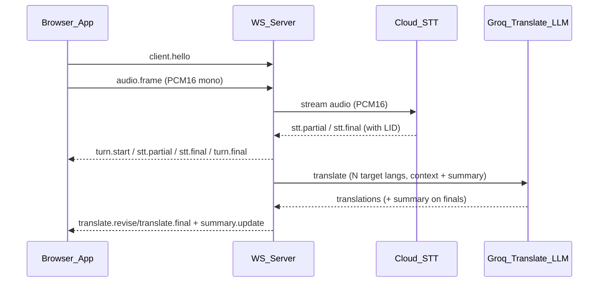
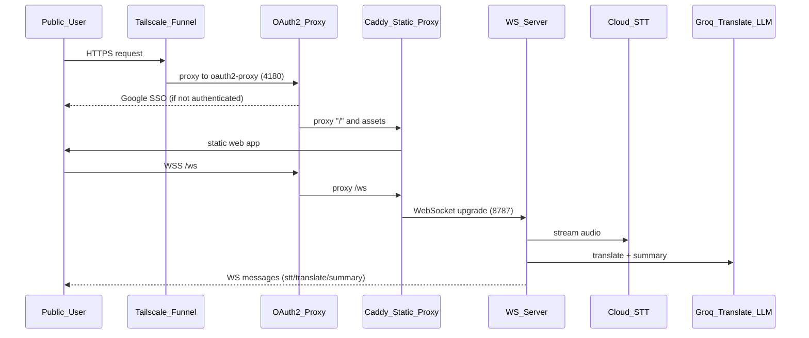

# Architecture (PoC)

## High-level flow

## Deployment topology (Docker + Tailscale Funnel)

Notes:
- `oauth2-proxy` enforces Google SSO + email allowlist.
- Tailscale Funnel terminates public HTTPS and forwards to the oauth2-proxy service.
- Web assets are served by Caddy; WS traffic is proxied to the Node server.

## Design invariants
- **Contracts-first**: `packages/shared` is the source of truth.
- **Low latency**: show `stt.partial` quickly; translation streams as available.
- **Turn separation**: UI renders *distinct* turn blocks; server emits explicit turn boundaries.
- **No secret leakage**: API keys are **server-side only**.
- **Explicit approvals**: any architectural change (data flow, module boundaries, protocols) must be approved by the project owner before merge.

## Runtime configuration
- **Target languages**: set via URL `langs=en,de,ru` (client) and/or `GROQ_TARGET_LANGS` (server default).
- **Original column**: toggle via URL `showOriginal=1|0` and UI toggle.
- **Summary panel**: toggle via URL `showSummary=1|0`.
- **Static context override**: via URL `staticContext=...` (client), overrides server default `GROQ_STATIC_CONTEXT`.

## Translation state (per session)
- **History buffer**: last 10 finalized utterances with original language and translations.
- **Summary**: English discussion summary updated on final utterances only.
- **Partial handling**: partials are translated for low latency but do not mutate summary/history.

## Repo layout
- `apps/web`: capture tab audio + render transcript UI
- `apps/server`: WebSocket server + STT + translation adapters
- `packages/shared`: protocol + interfaces + segmentation state machine
