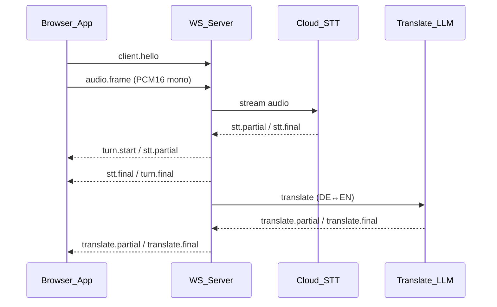

# Architecture (PoC)

## High-level flow

## Design invariants
- **Contracts-first**: `packages/shared` is the source of truth.
- **Low latency**: show `stt.partial` quickly; translation streams as available.
- **Turn separation**: UI renders *distinct* turn blocks; server emits explicit turn boundaries.
- **No secret leakage**: API keys are **server-side only**.

## Repo layout
- `apps/web`: capture tab audio + render transcript UI
- `apps/server`: WebSocket server + STT + translation adapters
- `packages/shared`: protocol + interfaces + segmentation state machine
